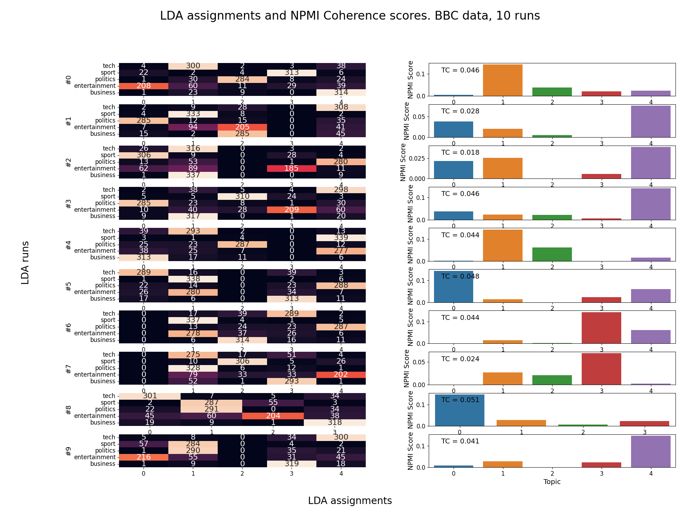

# Topic Modeling

In this study we observe how both LDA and BERTopic perform modeling the BBC news dataset. They are evaluated using a metric called Topic Coherence.

## Contents
- How To Use
- Dataset
- Results
- References 

## How To Use
In order for run_study.py to run properly, the function read_in_data needs to process a CSV that contains a document and label column. The document embeddings for the same data need to be read in as well.
~~~
read_directory = 'data/clean/'
result_directory = 'results/'

documents, labels, categories =  read_in_data(read_directory+'BBC_data_CLEAN.csv',   
    x_col = 1,  # column holding documents                              
    y_col = 2   # column holding labels
)

embeddings = joblib.load(read_directory + 'BBC_embeddings.z')
~~~
More information on the individual scripts is below.

#### run_study
This is the main script that creates a specified number of topic models, evaluates each and creates a report of the results. After the data is read in and parameters defined, the two functions below handle the rest of the work.

model_topics_in_batch trains the models, calculates topic coherence for each topic, and compiles the results in a dataframe.
~~~
result_df = model_topics_in_batch(
    model_name, 	# LDA or BERTopic
    documents, 		# cleaned document files
    embeddings, 	# embeddings for document files
    labels, 		# category for each document
    categories, 	# list of different categories in labels
    iters, 			# number of iterations to run
    N, 				# parameter for topic coherence, top N words are analyzed 
    **model_params	# parameters for LDA and BERTopic models
)
~~~
create_report creates a visual report from the results.
~~~
create_report(
    model_name,         # LDA or BERTopic
    ID,                 # randomly generated ID
    iters,              # number of iterations
    result_directory,   # write location for report
    result_df,          # output from model_topics_in_batch
)
~~~ 
 #### build_dataset.py
 The original BBC dataset is stored as individual files in labelled folders. This script compiles the data into a single CSV and stores it in the same directory as the data.

In my repository the labelled folders are placed in the location held by 'directory'.
~~~
directory = 'data/raw/bbc/'

# Write out dataframe.
df.to_csv('data/raw/'+'BBC_data.csv', index_label = 'Index')
~~~

#### clean_dataset
This script takes a dataset stored in a CSV file and prepares two versions that can be used by the models. 

Both versions are balanced via under-sampling and cleaned using functions found in tools.py. Only the second is preprocessed as defined by a third function found in the same location.
~~~
# Undersampled and cleaned
data_df.to_csv(directory + 'clean/' + name + '_CLEAN.csv', index = False)

# Undersampled, cleaned and preprocessed
data_df.to_csv(directory + 'clean/' + name + '_CLEAN_P.csv', index = False)
~~~
#### create_embeddings
The document embeddings created by a BERT model wouldn't meaningfully change from one iteration to another so we calculate them once here to be read in later. 

## Dataset
2225 BBC news articles gathered from 2004-2005. 

5 different categories : 
- Sports
- Politics
- Entertainment
- Business
- Tech

## Results

## References 

#### BBC Data :
http://mlg.ucd.ie/datasets/bbc.html

@inproceedings{
greene06icml,
	Author = {Derek Greene and P\'{a}draig Cunningham},
	Booktitle = {Proc. 23rd International Conference on Machine learning (ICML'06)},
	Pages = {377--384},
	Publisher = {ACM Press},
	Title = {Practical Solutions to the Problem of Diagonal Dominance in Kernel Document Clustering},
	Year = {2006}
	}

#### BERTopic Paper :
https://arxiv.org/abs/2203.05794

@article{
grootendorst2022bertopic,
  title={BERTopic: Neural topic modeling with a class-based TF-IDF procedure},
  author={Grootendorst, Maarten},
  journal={arXiv preprint arXiv:2203.05794},
  year={2022}
}

#### Topic Coherence Paper :
https://aclanthology.org/W13-0102.pdf

@inproceedings{aletras-stevenson-2013-evaluating,
    title = "Evaluating Topic Coherence Using Distributional Semantics",
    author = "Aletras, Nikolaos  and Stevenson, Mark",
    booktitle = "Proceedings of the 10th International Conference on Computational Semantics ({IWCS} 2013) {--} Long Papers",
    month = mar,
    year = "2013",
    address = "Potsdam, Germany",
    publisher = "Association for Computational Linguistics",
    url = "https://aclanthology.org/W13-0102",
    pages = "13--22",
}

#### NPMI Calculation Paper :
https://svn.spraakdata.gu.se/repos/gerlof/pub/www/Docs/npmi-pfd.pdf

@article{
	bouma2009,
	title = {Normalized (pointwise) mutual information in collocation extraction},
	author = {Gerlof Bouma}
	journal = {Proceedings of GSCL},
	year = {2009}
}

