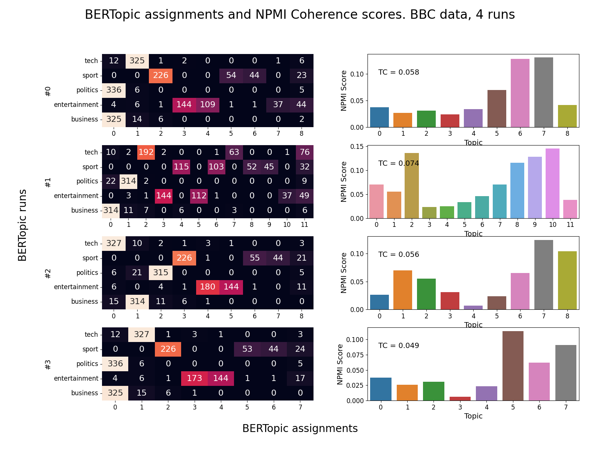
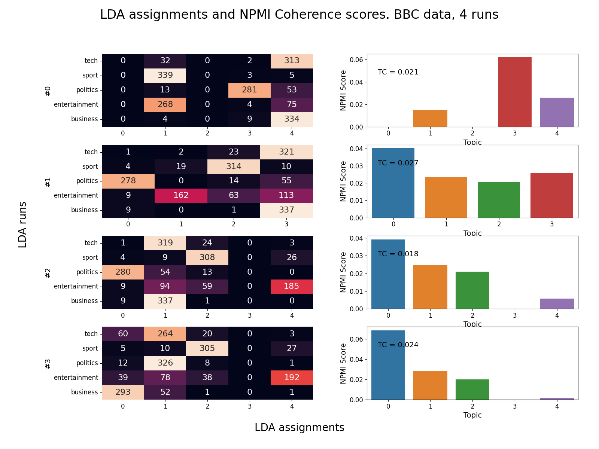

# Topic Modeling

Topic modeling is an unsupervised process where a model analyzes a collection of documents and creates topics by grouping similar documents together. This helps to answer very natural questions that arise when trying to understand large amounts of text. Questions like..

- What are these documents about? 
- How similar are these documents?
- Which other documents are similar to this one?

In this study we observe how two topic models, Latent Dirichlet Allocation (LDA) and BERTopic, perform modeling the BBC news dataset. 

#### why?
In order to make informed decisions on when to use models and how to tune them, we need quick/inexpensive methods to gauge their performance. Human judgement is considered the gold standard for judging relatedness in text/language but this approach doesn't scale well...humans can only read and comprehend small amounts of text at a time.

#### how?
The first method we use to evaluate our models is to look at how documents from a labelled dataset are distributed across the model's created topics. In the BBC dataset each document has one of 5 category labels..

- Sports
- Politics
- Entertainment
- Business
- Tech

The fewer documents from different categories a topic contains the better. In the generated reports, the left graphic for each run is a matrix that shows how many documents from each category make up each topic. The topics are designated by columns labelled starting at 0. For BERTopic, the outlier topic is always the highest numbered topic.

The second method we use is a calculated metric called Topic Coherence (TC). TC represents how often the most common words in a topic are found within the same document. Each topic receives a score [-1, 1], and their average is the model's score. There are a few different variants of this calculation and more information can be found in the References section. The bar graph on the right of the report shows each topic's score, with the model's TC score displayed in text.

## Contents
- Walkthrough
- Dataset
- Results
- References 

## Walkthrough

### run_study
This is the main script that creates `iters` number of topic models, evaluates each and builds a report of the results. 

In order for `run_study.py` to run properly, `read_in_data` needs a CSV that contains a document and label column. The document embeddings for the same data need to be read in as well.
~~~
read_directory = 'data/clean/'
result_directory = 'results/'

documents, labels, categories =  read_in_data(read_directory+'BBC_data_CLEAN.csv',   
    x_col = 1,  # column holding documents                              
    y_col = 2   # column holding labels
)

embeddings = joblib.load(read_directory + 'BBC_embeddings.z')
~~~

After the data is read in and parameters defined, the two functions below handle the rest of the work.

`model_topics_in_batch` trains the models, calculates topic coherence for each topic, and adds the results from each run to `result_df`.
~~~
result_df = model_topics_in_batch(
    model_name, 	# LDA or BERTopic
    documents, 		# cleaned document files
    embeddings, 	# embeddings for document files
    labels, 		# category for each document
    categories, 	# list of different categories in labels
    iters, 			# number of iterations to run
    N, 				# parameter for topic coherence, top N words are analyzed 
    **model_params	# parameters for LDA and BERTopic models
)
~~~
`create_report` creates a visual report from the results. The left matrix shows label distribution across topics. The right graph shows each topic's coherence score. The average of the topic's scores is the model's score. This value is displayed. 
~~~
create_report(
    model_name,         # LDA or BERTopic
    ID,                 # randomly generated ID
    iters,              # number of iterations
    result_directory,   # write location for report
    result_df,          # output from model_topics_in_batch
)
~~~ 
 ### build_dataset.py
The original BBC dataset is stored as individual files in labelled folders. This script compiles the data into a CSV and stores it in the same directory.

Set 'directory' to the location of the folders.
~~~
directory = 'data/raw/bbc/'

...

# Write out dataframe.
df.to_csv('data/raw/'+'BBC_data.csv', index_label = 'Index')
~~~

### clean_dataset
This script takes a dataset stored in a CSV file and prepares two versions that can be used by the models. This is not specific to the BBC data, the text and category columns to be processed are defined at the top by `TEXT_COL` and `CAT_COL`.

Both versions have null values dropped, duplicates dropped, and are balanced and cleaned via `undersample_dataframe` and `clean_text` functions in `tools.py`. The second version has `preprocess_text` applied as well.
~~~
...

# Undersampled and cleaned
data_df.to_csv(directory + 'clean/' + name + '_CLEAN.csv', index = False)

data_df[TEXT_COL] = data_df[TEXT_COL].apply(preprocess_text, args = [CUSTOM_STOPWORDS])

# Undersampled, cleaned and preprocessed
data_df.to_csv(directory + 'clean/' + name + '_CLEAN_P.csv', index = False)
~~~
### create_embeddings
The document embeddings created by a BERT model wouldn't meaningfully change from one iteration to another so we calculate them once here to be read in later.

~~~
#load sentence_model
model_name = "all-MiniLM-L6-v2"
sentence_model = SentenceTransformer(model_name)

#embed/vectorize documents
embeddings = sentence_model.encode(documents)

#write out embeddings
joblib.dump(embeddings, read_directory + 'BBC_embeddings.z')
~~~

## Dataset
2225 BBC news articles gathered from 2004-2005. 

5 different categories : 
- Sports
- Politics
- Entertainment
- Business
- Tech

#### BBC Data document counts
|Category|Original|After cleaning and balancing|
|--------|--------|--------------|
|Sports|511|347|
|Politics|417|347|
|Entertainment|386|347|
|Business|510|347|
|Tech|401|347|

## Results

### BERTopic Results

### LDA Results

## References 

#### BBC Data :
http://mlg.ucd.ie/datasets/bbc.html

@inproceedings{
greene06icml,
	Author = {Derek Greene and P\'{a}draig Cunningham},
	Booktitle = {Proc. 23rd International Conference on Machine learning (ICML'06)},
	Pages = {377--384},
	Publisher = {ACM Press},
	Title = {Practical Solutions to the Problem of Diagonal Dominance in Kernel Document Clustering},
	Year = {2006}
	}

#### BERTopic Paper :
https://arxiv.org/abs/2203.05794

@article{
grootendorst2022bertopic,
  title={BERTopic: Neural topic modeling with a class-based TF-IDF procedure},
  author={Grootendorst, Maarten},
  journal={arXiv preprint arXiv:2203.05794},
  year={2022}
}

#### Topic Coherence Papers :
https://svn.spraakdata.gu.se/repos/gerlof/pub/www/Docs/npmi-pfd.pdf

@article{
	bouma2009,
	title = {Normalized (pointwise) mutual information in collocation extraction},
	author = {Gerlof Bouma}
	journal = {Proceedings of GSCL},
	year = {2009}
}

https://aclanthology.org/W13-0102.pdf

@inproceedings{aletras-stevenson-2013-evaluating,
    title = "Evaluating Topic Coherence Using Distributional Semantics",
    author = "Aletras, Nikolaos  and Stevenson, Mark",
    booktitle = "Proceedings of the 10th International Conference on Computational Semantics ({IWCS} 2013) {--} Long Papers",
    month = mar,
    year = "2013",
    address = "Potsdam, Germany",
    publisher = "Association for Computational Linguistics",
    url = "https://aclanthology.org/W13-0102",
    pages = "13--22",
}

